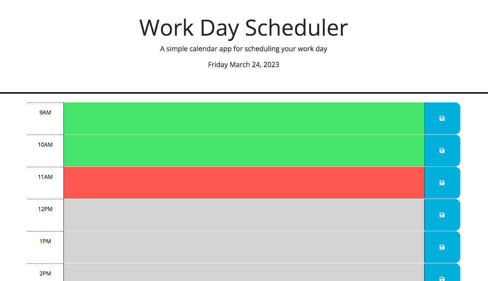

# challenge-5-work-day-scheduler

## Description
  In this weeks challenge assignment I was tasked to finish the code of a daily planner that is used to create a schedule for a work day. When the planner is opened the current day is displayed at the top of the planner calendar. When the user scrolls down, they are presented with standard business hour time blocks. Each of those time blocks are color-coded to indicate if it is the past present or future, compared to the hour of day it currently is. Green is the past, Red is the present, and Gray is the future. When the user clicks into the time block, the user can enter an event. When the user clicks the save button for that time block the event text that the user input is saved into local storage. When the user refreshes the page the text event that was saved in local storage persists, and does not disappear.

   

## Installation

N/A

## Usage
This work day scheduler is a wonderful tool for anyone who has a busy day ahead of them. They are able to keep track of all the events that they have going on that day. They are able to see what scheduled events have passed, what scheduled events are coming up later on in the day, and what is currently scheduled to be done. Since the planner is also color-coded it is much easier to know what is happening. This assignment could be very useful and helpful for the user to keep track of time and events that have scheduled for any day!

https://vitafomin.github.io/challenge-5-work-day-scheduler/

## Credits

N/A

## License

Please refer to the LICENSE in the repo